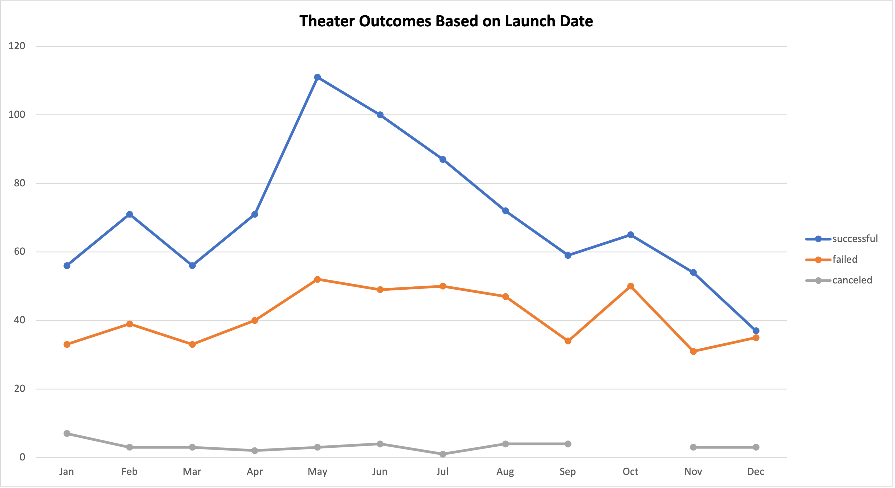
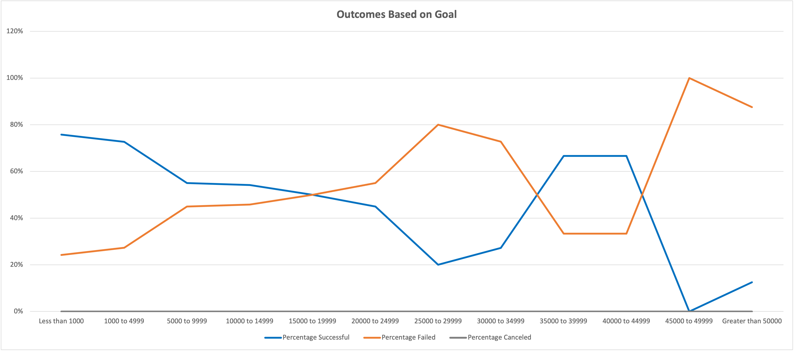

# Kickstarting with Excel

## Overview of Project
Louise recently launched a play, called *Fever*. She was able to fairly quickly raise nearly all of her original fundraising goal amount. Now, she has asked for analysis to be done to know how other campaigns fared compared to *Fever*, in relation to their launch dates and funding goals. 
### Purpose
Louise wants to better understand how launch dates, or the time of the year, may have affected the outcomes for the various campaigns, so that she can set an ideal launch date for her next play. She also wants to figure out what funding goal levels had the best outcomes. Knowing this will help her to set a funding goal amount that will increase her chances for success in her next campaign.

## Analysis and Challenges

### Analysis of Outcomes Based on Launch Date
#### **Setup**
I created a pivot table with filters for the "parent category" and "years", with the "parent category" filtered to "theater". I created rows for the "date created", broken down by months, and columns with the outcomes broken down by "successful", "failed" and "canceled". Finally, I created a line chart to visualize the pivot table for greater insights (see *Chart 1*, below). 
#### **Analysis**
As I analyzed the theater launch date chart, several things became clear:
* Every month of the year had more successful launches than failed or canceled launches.
* The number of failed and canceled launches stayed fairly consistent regardless of time of year.
* The largest differences between "successful", "failed" and "canceled" launches occurred during the months of May, June and July.

##### *Chart 1*

### Analysis of Outcomes Based on Goals
#### **Setup**
I created a table with columns displaying outcomes data for the following, using "COUNTIF" formulas to filter on:
* Goal levels
* Number of successful, failed and canceled plays (3 separate columns)
* Percentage of successful, failed and canceled plays (3 separate columns)
* Total plays

Using this table, I created a plays goal outcomes line chart to visualize the data for greater insights (see *Chart 2*, below). 
#### **Analysis**
As I analyzed the chart, some items stood out:
* As the goal levels increased (from $0 to greater than $50,000), there tended to be an overall downward trend in the percentage of goals that were successful, with an exception in the $35,000-$45,000 range.
* There were no canceled plays, regardless of goal level.
* The percentage of successful plays with fundraising goals of $45,000 or higher was 13% or lower.

##### *Chart 2*

### Challenges and Difficulties Encountered
I ran into some challenges while setting up the tables. For the "Theater Outcomes by Launch Date" table, I initially didn't see the "outcomes" data broken down by months, but was able to fix this with some adjustments to group the "Row Labels" column. On the "Outcomes Based on Goals" table, for the COUNTIFS function, I incorrectly referenced the "pledged" column instead of the "goals" column for several arrays, and after some troubleshooting realized the discrepancy and fixed it. 

## Results
### Results of Outcomes Based on Launch Date
Regarding the outcomes based on a launch date data, there are several conclusions that can be drawn:
* It would make the most sense for Louise to launch upcoming plays during the months of May, June and July, as the data shows that launches tend to have the most success during those months.
* Launching plays during the other months of the year will likely also have more successes than failures and cancelations.

### Results of Outcomes Based on Goals
Regarding the outcomes based on goals data, it can be concluded that Louise would be likely be more successful if she set her fundraising goals in the $0-$10,000 range and also in the $35,000-$45,000 range, based on the data that's been analyzed.

### Data Set Limitations
There are some limitations with this dataset, such as it doesn't include other additional external factors that may have had an affect on outcomes, such as competitor launches, economic conditions, weather anomalies, or having a better understanding of the reasons for no cancelations.

### Other Possible Tables or Graphs
Some other possible tables or graphs that could provide additional insights would be to visualize the duration in which plays ran, to understand if that had an effect on the success or failure, and if perhaps there was a success-related correlation between seasonality and play duration.  
